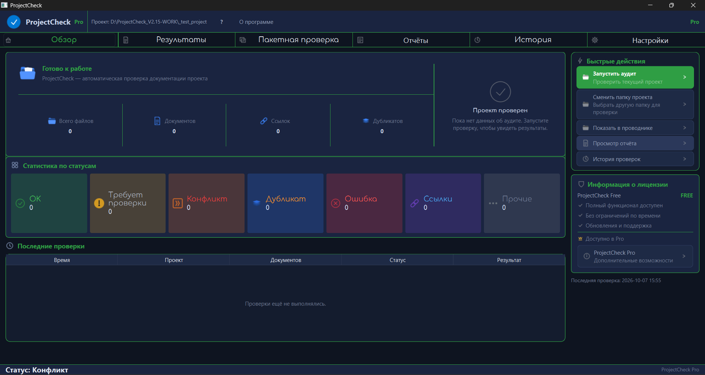
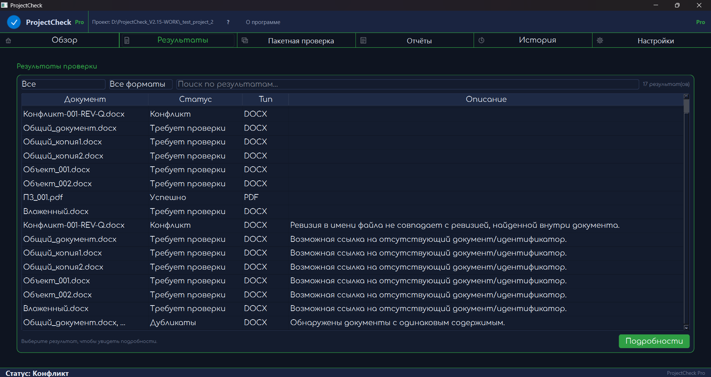
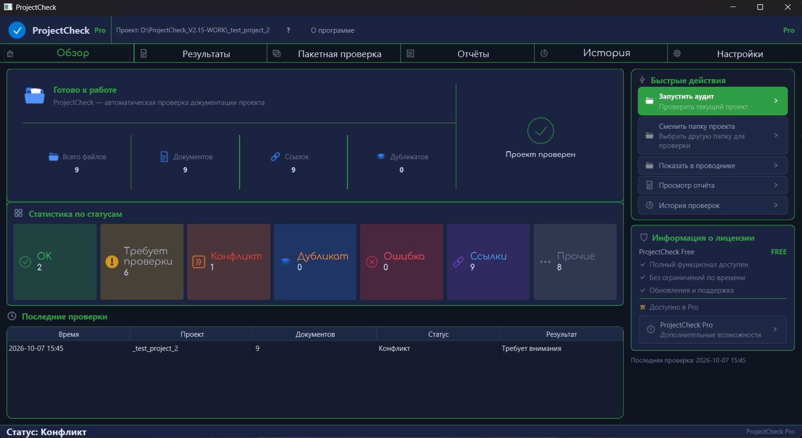
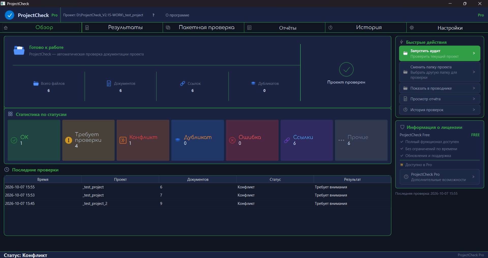
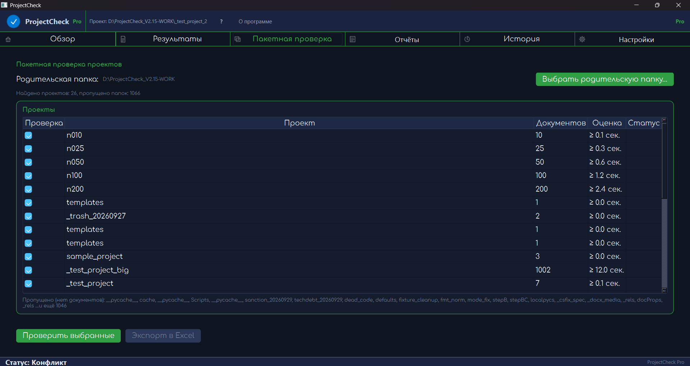
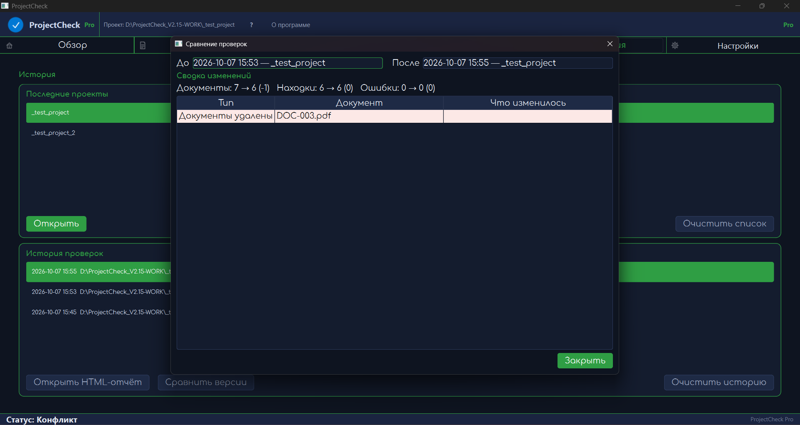
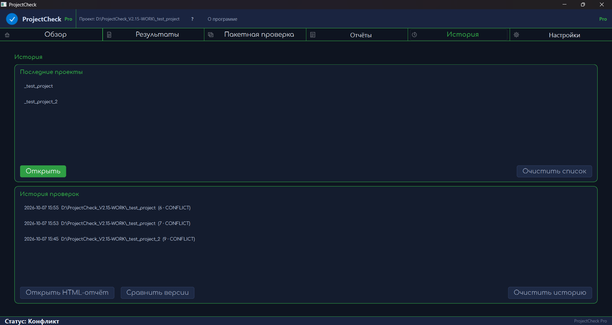

# ProjectCheck

**Автоматическая проверка проектной документации**

---

## О программе

ProjectCheck — настольное приложение для автоматической проверки
проектной документации. Находит конфликты ревизий, дубликаты файлов
(SHA-256), битые ссылки и ошибки чтения. Работает полностью офлайн.

Поддерживаемые форматы: `.docx`, `.xlsx`, `.xlsm`, `.pdf`

---

## ✦ Купить Pro — 2 990 ₽

**Pro открывает 4 дополнительные функции:**

| Функция | Free | Pro |
|---|:---:|:---:|
| Одиночная проверка проекта | ✅ | ✅ |
| HTML / CSV / TXT экспорт | ✅ | ✅ |
| История 10 проверок | ✅ | ✅ |
| **Пакетная проверка (Batch)** | — | ✅ |
| **Сводный отчёт по всем проектам** | — | ✅ |
| **Экспорт в Excel (XLSX)** | — | ✅ |
| **Сравнение версий (Diff)** | — | ✅ |

**Как купить:**
1. Напишите на **mikhail.region@mail.ru** — тема «ProjectCheck Pro»
2. Укажите email для получения лицензии
3. Оплатите (реквизиты вышлем в ответ)
4. Получите код активации вида `PC1.xxxxxxxx`
5. Введите код в приложении: **Настройки → Лицензия → Активировать**

**Способ оплаты:** перевод на карту / СБП / ЮMoney
**Чек:** самозанятый, чек формируется через «Мой налог»
**Возврат:** 14 дней, если Pro-функции не работают

Лицензия привязывается к устройству (device-bound), работает офлайн,
не требует подключения к интернету.

---

## Скриншоты

*Главный дашборд*

*Результаты аудита документа*

*Пример проверки: конфликты ревизий*

*Пример проверки: дубликаты (SHA-256)*

*Пример проверки: битые ссылки*

*Пакетная проверка нескольких проектов (Pro)*

*Сравнение версий документа (Pro)*

*История проверок*

---

## Установка

1. Скачайте `ProjectCheck.exe` из раздела [Releases](../../releases)
2. Запустите — установка не требуется (portable)
3. При первом запуске ознакомьтесь с условиями использования

**Системные требования:**
- Windows 10 / 11 (x64)
- 4 GB RAM
- 200 MB свободного места

---

## Возможности

**Free:**
- Проверка одного проекта
- Отчёт в HTML
- Экспорт CSV / TXT
- История 10 проверок
- Полностью офлайн-работа
- Локализация RU / EN
- Настройка внешнего вида

**Pro (2 990 ₽):**
- Пакетная проверка (несколько проектов за раз)
- Сводный отчёт по всем проектам
- Экспорт в Excel (XLSX)
- Сравнение версий (Diff)

---

## Лицензия

ProjectCheck — проприетарное программное обеспечение.
Исходный код закрыт и не распространяется.

Условия использования изложены в файле [EULA_RU.md](EULA_RU.md)
и отображаются внутри приложения (раздел «Справка → Лицензия»).

⚠️ **Дисклеймер:** текст EULA составлен автором и не проходил
юридическую экспертизу. Использование — на условиях «as is».

---

## Контакты

- **Email:** mikhail.region@mail.ru
- **GitHub Issues:** https://github.com/miha84383-a11y/projectcheck/issues

По вопросам покупки Pro — пишите на email с темой «ProjectCheck Pro».

---

## English (short)

**ProjectCheck** — desktop app for automated project documentation audit.
Finds revision conflicts, file duplicates (SHA-256), broken links, read errors.
Works fully offline. Formats: .docx, .xlsx, .xlsm, .pdf

**Free:** single project audit, HTML/CSV/TXT export, history of 10 runs.
**Pro (2990 RUB):** batch audit, summary report, XLSX export, version diff.

Download `ProjectCheck.exe` from [Releases](../../releases).

Proprietary software. Source code not distributed.
See [EULA_EN.md](EULA_EN.md) for terms.